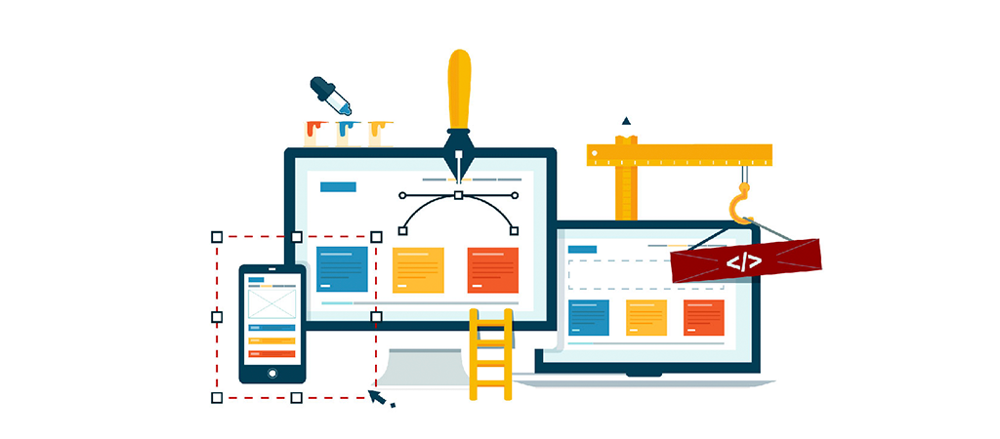

# Curso: Maquetador web Avanzado  |  código 69937

> Curso Maquetador web Avanzado |   
> Martes y Miércoles y Viernes 13:30hs a 16:30hs (Arg) |  
> 10 clases desde 15/08 hasta 05/09
> Código: 69937 |  
> sensei: Marcos Pinardi |

--- 

### Aprende a crear interfaces web con los dos lenguajes que constituyen la esencia de la red.  Domina herramientas avanzadas de maquetado, incorpora efectos, animaciones y estilos para realizar webs impactantes.

---

 
 